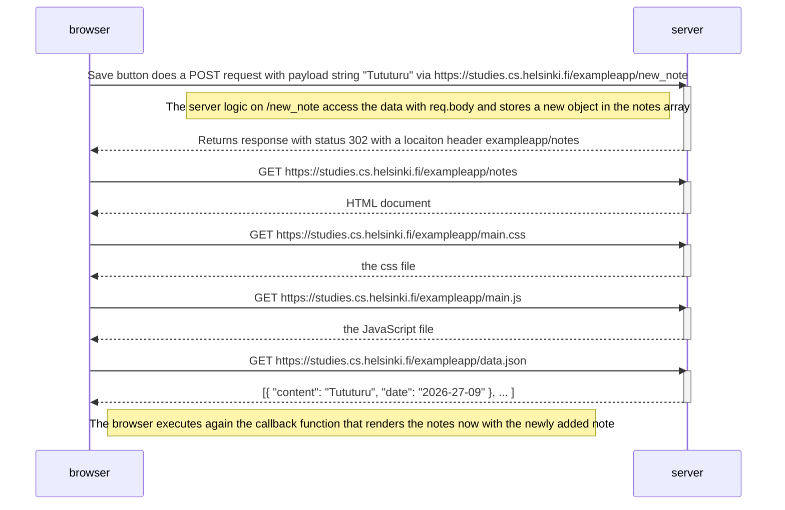

```mermaid
sequenceDiagram
    participant browser
    participant server

    browser->>server: Save button does a POST request with payload string "Tututuru" via https://studies.cs.helsinki.fi/exampleapp/new_note
    activate server

    Note left of server: The server logic on /new_note access the data with req.body and stores a new object in the notes array

    server-->>browser: Returns response with status 302 with a locaiton header exampleapp/notes
    deactivate server

    browser->>server: GET https://studies.cs.helsinki.fi/exampleapp/notes
    activate server
    server-->>browser: HTML document
    deactivate server

    browser->>server: GET https://studies.cs.helsinki.fi/exampleapp/main.css
    activate server
    server-->>browser: the css file
    deactivate server

    browser->>server: GET https://studies.cs.helsinki.fi/exampleapp/main.js
    activate server
    server-->>browser: the JavaScript file
    deactivate server

    browser->>server: GET https://studies.cs.helsinki.fi/exampleapp/data.json
    activate server
    server-->>browser: [{ "content": "Tututuru", "date": "2026-27-09" }, ... ]
    deactivate server

    Note right of browser: The browser executes again the callback function that renders the notes now with the newly added note
```
