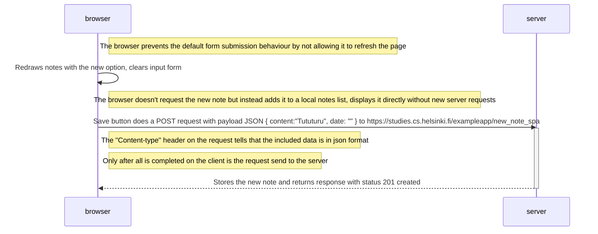

```mermaid
sequenceDiagram
    participant browser
    participant server

    Note right of browser: The browser prevents the default form submission behaviour by not allowing it to refresh the page 

    browser->>browser: Redraws notes with the new option, clears input form
    
    Note right of browser: The browser doesn't request the new note but instead adds it to a local notes list, displays it directly without new server requests

    browser->>server: Save button does a POST request with payload JSON { content:"Tututuru", date: "" } to https://studies.cs.helsinki.fi/exampleapp/new_note_spa
    activate server

    Note right of browser: The "Content-type" header on the request tells that the included data is in json format

    Note right of browser: Only after all is completed on the client is the request send to the server
    
    server-->>browser: Stores the new note and returns response with status 201 created
    deactivate server
```
